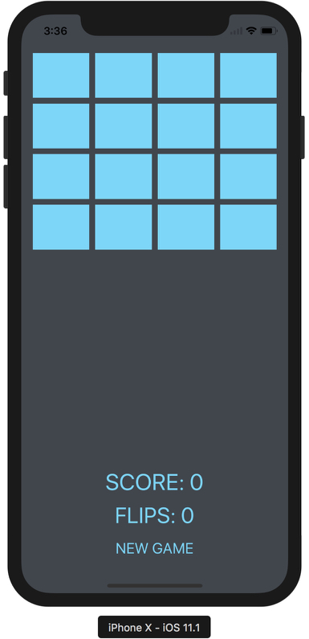

# Concentration

**Required Tasks**

- [x] Get the Concentration game working as demonstrated in lectures 1 and 2. Type in allthe code. Do not copy/paste from anywhere.
- [x] Add more cards to the game.
- [x] Add a “New Game” button to your UI which ends the current game in progress andbegins a brand new game.
- [x] Currently the cards in the Model are not randomized (that’s why matching cards endup always in the same place in our UI). Shuffle the cards in Concentration’s init()method.
- [x] Give your game the concept of a “theme”. A theme determines the set of emoji fromwhich cards are chosen. All emoji in a given theme are related by that theme. See theHints for example themes. Your game should have at least 6 different themes andshould choose a random theme each time a new game starts.
- [x] Your architecture must make it possible to add a new theme in a single line of code.
- [x] Add a game score label to your UI. Score the game by giving 2 points for every matchand penalizing 1 point for every previously seen card that is involved in a mismatch.
- [x] Tracking the flip count almost certainly does not belong in your Controller in a properMVC architecture. Fix that.
- [x] All new UI you add should be nicely laid out and look good in portrait mode on aniPhone X.

**Demo**

