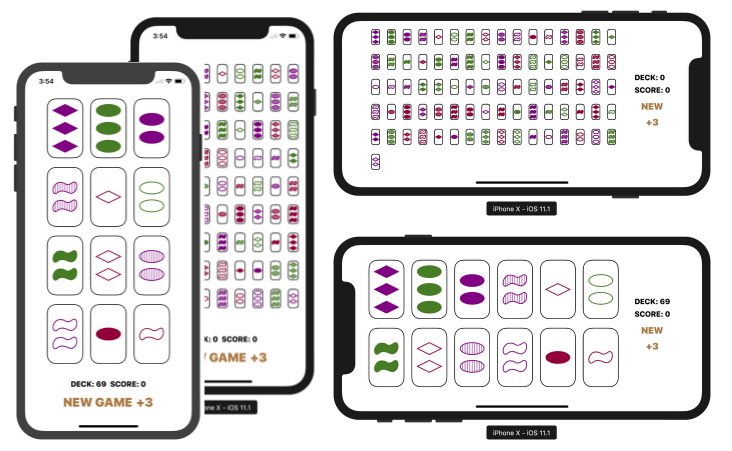

# Graphical Set

**Required Tasks**

- [x] Your application should continue to play a solo game of Set as required byAssignment 2.
- [x] In this version, however, you are not to limit the user-interface to a fixed number ofcards. You should always be prepared to Deal 3 More Cards. The only time the Deal3 More Cards button will be disabled is if there are no more cards left in the deck.
- [x] Do not “pre-allocate” space for all 81 possible cards. At any given time, cards shouldbe as large as possible given the screen real estate available to cards and the number ofcards currently in play. In other words, when the game starts (with only 12 cards), thecards will be pretty big, but as more and more cards appear on screen (due to Deal 3More Cards), they will have to get smaller and smaller to fit.
- [x] Towards the end of the game, when 3 cards are matched and there are no more cardsin the Set deck, the matching cards should be removed from the screen entirely andthe remaining cards should “re-form up” to use the space freed up by these departingcards (i.e. getting a bit larger again if space allows).
- [x] Cards must have a “standard” look and feel (i.e. 1, 2 or 3 squiggles, diamonds or ovalsthat are solid, striped or unfilled and are either green, red or purple). You must drawthem using UIBezierPath and/or CoreGraphics functions. You may not useattributed strings nor UIImages to draw your cards.
- [x] Whatever way you draw your cards must scale with the size of the card (obviously, tosupport Required Task 3).
- [x] On cards that have more than one symbol, you are allowed to draw the symbols onhorizontally across or vertically down (or even have that depend on the aspect ratio ofthe card at the time it is being drawn).
- [x] A tap gesture on a card should select/deselect it.
- [x] A swipe down gesture in your game should Deal 3 More Cards.
- [x] Add a rotation gesture (two fingers rotating like turning a knob) to cause all of yourcards to randomly reshuffle (it’s useful when the user is “stuck” and can’t find a Set).This might require a modification to your Model.
- [x] Your game must work properly and look good in both Landscape and Portraitorientations on all iPhones and iPads. It should efficiently use all the space available toit in all circumstances. 

**Problem**

1. There are two thin black lines around the card.

**Demo**

