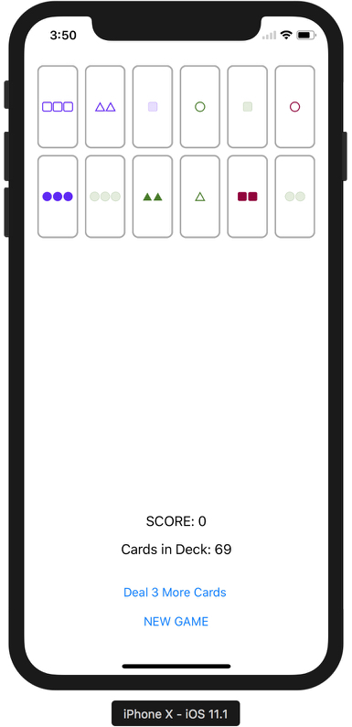

# Set

**Required Tasks**

- [x] Implement a game of solo (i.e. one player) Set.

- [x] Have room on the screen for at least 24 Set cards. All cards are always face up in Set.

- [x] Deal 12 cards only to start. They can appear anywhere on screen (i.e. they don’t haveto be aligned at the top or bottom or anything; they can be scattered to start if youwant), but should not overlap.

- [x] You will also need a “Deal 3 More Cards” button (as per the rules of Set).

- [x] Allow the user to select cards to try to match as a Set by touching on the cards. It isup to you how you want to show “selection” in your UI. See Hints below for someideas. Also support “deselection” (but when only 1 or 2 (not 3) cards are currentlyselected).

- [x] After 3 cards have been selected, you must indicate whether those 3 cards are a matchor a mismatch (per Set rules). You can do this with coloration or however you choose,but it should be clear to the user whether the 3 cards they selected match or not.

- [x] When any card is chosen and there are already 3 non-matching Set cards selected,deselect those 3 non-matching cards and then select the chosen card.

- [x] As per the rules of Set, when any card is chosen and there are already 3 matchingSet cards selected, replace those 3 matching Set cards with new ones from the deck of81 Set cards (again, see Set rules for what’s in a Set deck). If the deck is empty thenmatched cards can’t be replaced, but they should be hidden in the UI. If the card thatwas chosen was one of the 3 matching cards, then no card should be selected (sincethe selected card was either replaced or is no longer visible in the UI).

- [ ] When the Deal 3 More Cards button is pressed either a) replace the selected cards ifthey are a match or b) add 3 cards to the game.

- [x] The Deal 3 More Cards button should be disabled if there are a) no more cards in theSet deck or b) no more room in the UI to fit 3 more cards (note that there is alwaysroom for 3 more cards if the 3 currently-selected cards are a match since you replacethem).

- [x] Instead of drawing the Set cards in the classic form (we’ll do that next week), we’ll usethese three characters ▲ ● ■ and use attributes in NSAttributedString to draw themappropriately (i.e. colors and shading). That way your cards can just be UIButtons.See the Hints for some suggestions for how to show the various Set cards.

- [ ] Use a method that takes a closure as an argument as a meaningful part of yoursolution. You cannot use one that was shown in lecture.

- [x] Use an enum as a meaningful part of your solution.

- [ ] Add a sensible extension to some data structure as a meaningful part of your

      solution. You cannot use one that was shown in lecture.

- [x] Your UI should be nicely laid out and look good (at least in portrait mode, preferablyin landscape as well, though not required) on any iPhone 7 or later device. Thismeans you’ll need to do some simple Autolayout with stack views.

- [x] Like you did for Concentration, you must have a New Game button and show theScore in the UI. It is up to you how you want to score your Set game. For example,you could give 3 points for a match and -5 for a mismatch and maybe even -1 for adeselection. Perhaps fewer points are scored depending on how many cards are onthe table (i.e. how many times Deal 3 More Cards has been touched). Whatever youthink best evaluates how well the player is playing. 

**Demo**

